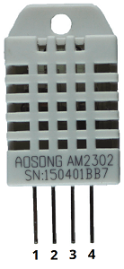

## 🌡️ Sensor de Temperatura e Umidade: DHT22

**Especificações:**
- Faixa de temperatura: -40 °C a +80 °C (±0.5 °C)
- Faixa de umidade relativa: 0% a 100% RH (±2%)
- Resolução de temperatura: 0.1 °C
- Resolução de umidade: 0.1 %
- Tensão de operação: 3 V a 6 V DC
- Corrente de alimentação: 1 a 1.5 mA
- Período de amostragem: 2 segundos

| **Pino** | **Conexão**                                                                 |
|-------------|---------------------------------------------------------------------------------|
| 1           | `3.3V`                                                                          |
| 2           | Qualquer pino de entrada do ESP; resistor de pull-up de 10k Ohm                   |
| 3           | N/A                                                                   |
| 4           | `GND`                                                                           |

## Biblioteca utilizada
Para fazermos as leituras do DHT, utilizamos a biblioteca [DHT library](https://github.com/adafruit/DHT-sensor-library) disponível na Arduino IDE.
