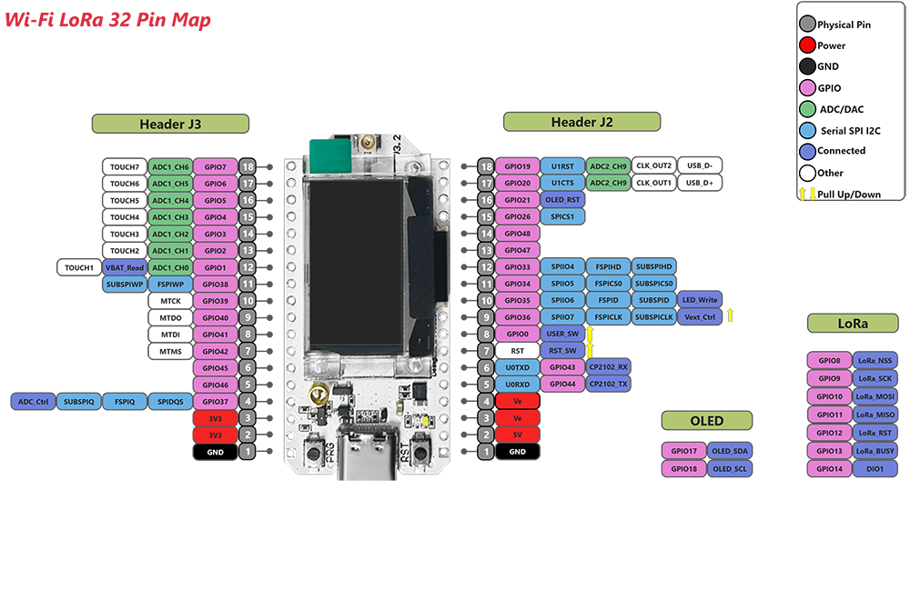

## 📱 ESP32 LoRa Heltec V3

**Principais características:**
- Microcontrolador: ESP32-S3FN8 (dual-core, 240 MHz, Wi-Fi + Bluetooth 5.0)
- Memória: 8 MB Flash externa, 512 KB SRAM interna
- Módulo LoRa: Semtech SX1262
- Faixa de frequência: 433–510 MHz ou 863–928 MHz (dependendo do modelo)
- Potência de transmissão LoRa: 21 ±1 dBm
- Sensibilidade de recepção LoRa: até -136 dBm @ SF12 BW=125 KHz
- Display: OLED 0,96", 128x64 pixels, controlador SSD1306 via I2C
- Conectores: USB Tipo-C, conector IPEX para antena LoRa, conector SH1.25 para bateria LiPo
- Antena Wi-Fi/Bluetooth: Interna 2.4 GHz
- Interfaces disponíveis: 3 UARTs, 2 I2C, 2 SPI, ADCs, GPIOs, entradas touch
- Tensão de operação: 3,3V a 7V (com carregamento de bateria integrado)
- [Referência](https://heltec.org/project/wifi-lora-32-v3/)
