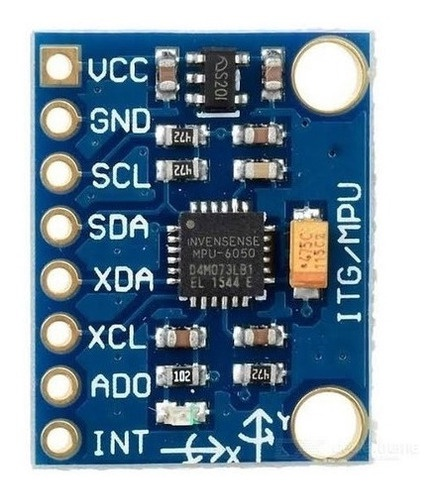

## 🧭 Sensor de Aceleração e Giroscópio: MPU6050

**Especificações:**
- Sensor: MPU6050
- Tensão de operação: 3.3 V a 5 V
- Interface: I2C
- Acelerômetro: ±2g, ±4g, ±8g, ±16g
- Giroscópio: ±250, ±500, ±1000, ±2000 °/s
- Temperatura de operação: -40 °C a +85 °C
- Conversor A/D: 16 bits
- Clock interno: 8 MHz
- Frequência de amostragem: Até 1 kHz
- Sensor de temperatura interno
- [Referência](https://www.alldatasheet.com/datasheet-pdf/view/1132807/TDK/MPU-6050.html)

| **Pino** | **Conexão**                                                                 |
|-------------|---------------------------------------------------------------------------------|
| VCC         | `3.3V ou 5V`                                                                    |
| GND         | `GND`                                                                           |
| SCL         | `GPIO 22`                                                                       |
| SDA         | `GPIO 21`                                                                       |
| INT         | (Não utilizado - pode ser conectado a uma GPIO caso utilize interrupções)       |
| XCL         | (Não utilizado - saída de clock I2C para conectar sensores externos)            |
| XDA         | (Não utilizado - linha de dados I2C para sensores externos)                     |

## Biblioteca utilizada
Para realizar a comunicação com o MPU6050, utilizamos a biblioteca [Adafruit MPU6050](https://github.com/adafruit/Adafruit_MPU6050) disponível na Arduino IDE.
