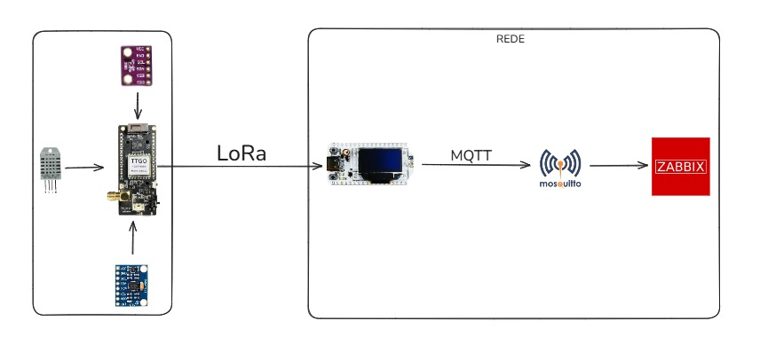

Projeto ESP32 LoRa com MQTT para Zabbix.

Este projeto tem como objetivo adquirir dados de sensores utilizando um módulo **ESP32 LoRa TTGO**, enviando essas informações via LoRa para um **ESP32 LoRa Heltec v3**, este segundo dispositivo envia, por sua vez, os dados através do protocolo **MQTT** para o **Zabbix** com o **Mosquitto** funcionando como broker MQTT. 

---

## 🧩 Tecnologias Utilizadas

- **ESP32 LoRa TTGO** – Microcontrolador com suporte LoRa (Long Range) para comunicação de longo alcance.  
- **ESP32 LoRa Heltec v3** – Microcontrolador com suporte LoRa (Long Range) para comunicação de longo alcance e display OLED.  
- **MQTT (Mosquitto)** – Protocolo leve de mensagens usado para envio dos dados.  
- **Zabbix** – Sistema de monitoramento de redes, utilizado para visualizar os dados.  
- **Arduino IDE 1.8.19** – Ambiente de desenvolvimento.  
- **Sensores** – DHT22, GY-BMP280, MPU6050.  

---

## Arquitetura

    

## Documentação

- 📘  [Configuração do Zabbix](ZABBIX.md)
- 📘  [Comunicação MQTT-Zabbix](MQTT.md)
- 📚  [Source-Sender](ttgoSender/)
- 📚  [Source-Receiver](heltecReceiver/)
- 📱  [TTGO LoRa](TTGO.md)
- 📱  [Heltec v3 LoRa](HELTECV3.md)
- 🔌  [DHT22](DHT22.md)
- 🔌  [GY-BMP280](BMP280.md)
- 🔌  [MPU6050](MPU6050.md)

## Protótipo 

    

