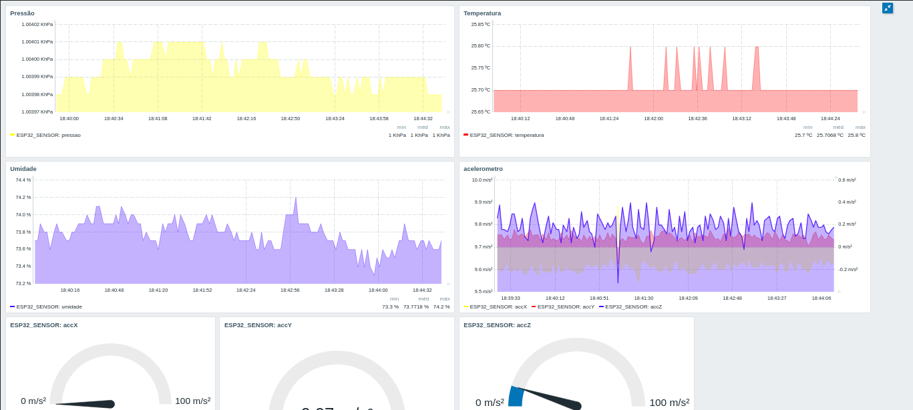
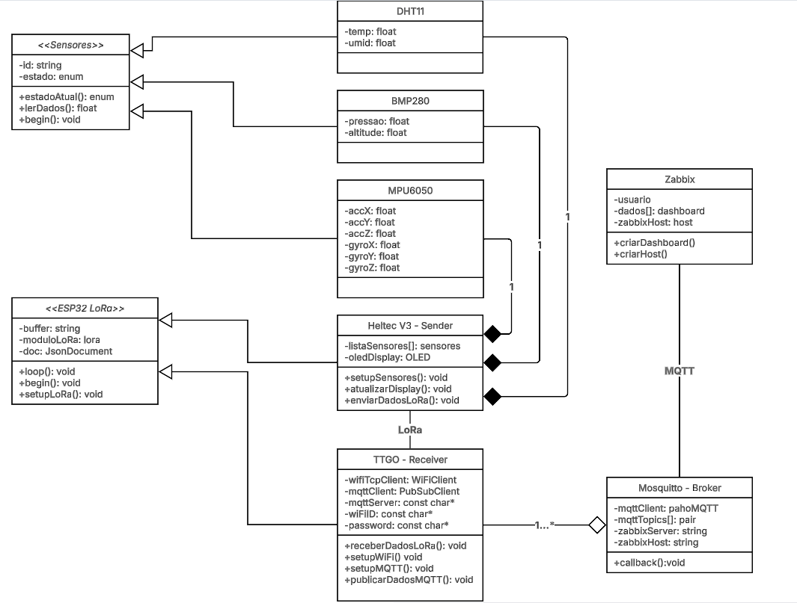
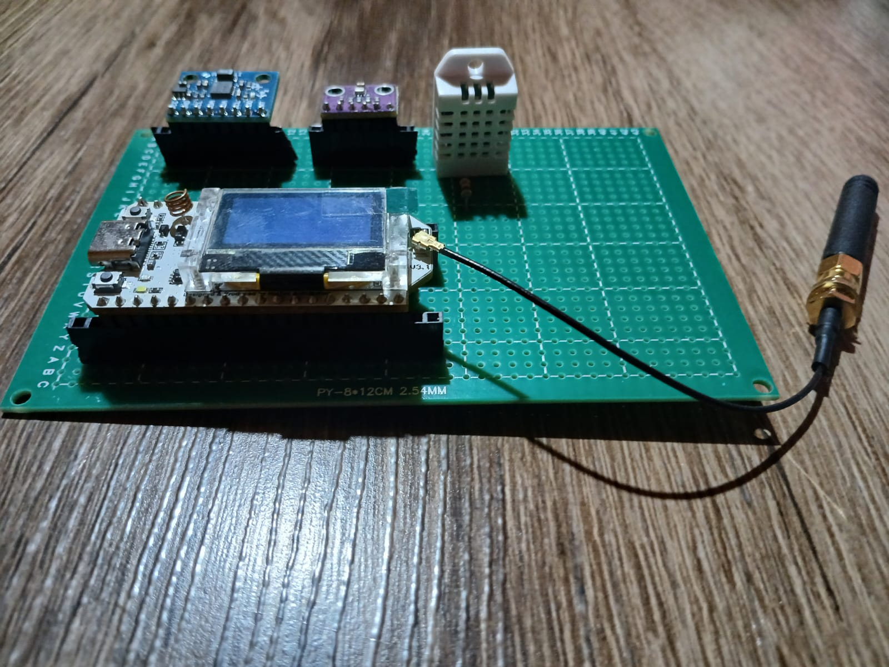

Protótipo para monitoramento de bovinos a pasto.

Este projeto é baseado em um problema mais amplo, relacionado ao monitoramento de bovinos a pasto. A proposta é comprovar a viabilidade de coleta, transmissão e recepção de dados, dentro deste contexto, utilizando tecnologias de baixo custo e que permitam escalabilidade. Para isto, criamos uma placa baseada no funcionamento de um ESP32, capaz de se comunicar com outros dispositivos através da comunicação LoRa. Outros dispositivos podem ser Gateways ou nodos, permitindo integrar a informação coletada com  plataformas de monitoramento, além de replicar os dados para atingir distâncias maiores, se necessário. Utilizamos o Zabbix como plataforma de monitoramento e sensores para simular os dados coletados localmente, embora esta última parte seja uma abstração, ela de maneira alguma interfere na lógica da resolução do problema caso ele fosse aplicado na situação real. Para fazer a comunicação entre o Gateway e o Zabbix, utilizamos o protocólo MQTT.

---

## 🧩 Tecnologias Utilizadas

- **ESP32 LoRa TTGO** – Microcontrolador com suporte LoRa (Long Range) para comunicação de longo alcance.  
- **ESP32 LoRa Heltec v3** – Microcontrolador com suporte LoRa (Long Range) para comunicação de longo alcance e display OLED.  
- **MQTT (Mosquitto)** – Protocolo leve de mensagens usado para envio dos dados.  
- **Zabbix** – Sistema de monitoramento de redes, utilizado para visualizar os dados.  
- **Arduino IDE 1.8.19** – Ambiente de desenvolvimento.  
- **Sensores** – DHT22, GY-BMP280, MPU6050.  

---

## Arquitetura

    

Os dados coletados localmente pelo Heltec V3 são enviados através do LoRa para outro ESP32 receptor que funciona como um Gateway, conectando-se ao broker Mosquitto que faz o repasse de informações para o Zabbix através da biblioteca Paho MQTT, em Python. 

---

## Esquema de conexão

    

Este diagrama mostra a ligação dos três sensores à placa microcontroladora ESP32 LoRa Heltec V3, a alimentação de todos os componentes é feita com 3.3V. 

### 📦 Componentes Conectados:

#### 1. DHT22 (Sensor de Temperatura e Umidade)
- Alimentado com **3.3V**
- Pino de dados conectado ao **GPIO4**
- Resistor de **10kΩ pull-up** entre o pino de dados e 3.3V

#### 2. BMP280 (Sensor de Pressão e Temperatura - I2C)
- **SDA** → **GPIO41**
- **SCL** → **GPIO42**
- Alimentado com **3.3V**
- Outros pinos (CSB, SDO) não utilizados (I2C padrão)

#### 3. MPU6050 (Acelerômetro e Giroscópio - I2C)
- Compartilha o barramento I2C com o BMP280:
  - **SDA** → **GPIO41**
  - **SCL** → **GPIO42**
- Alimentado com **3.3V**
- Pinos **XDA/XCL** não utilizados (para comunicação auxiliar com outros sensores)

---

## Dashboard

    

Exemplo de Dashboard criado no Zabbix com os dados coletados. 

### 🛠️ Como criar o dashboard no Zabbix

> ⚠️ **Pré-requisito:** Certifique-se de que já existe um **host** configurado no Zabbix (ex: `ESP32_SENSOR`) com os **itens** correspondentes às medições dos sensores (como `temperatura`, `umidade`, `pressao`, `accX`, `accY`, `accZ`). Esses itens devem estar sendo atualizados corretamente via agente MQTT.

#### Criando um host e itens:

1. Vá para **Monitoramento > Hosts** e clique em **Criar host**.
2. Defina o nome (ex: `ESP32_SENSOR`) e vincule-o a um grupo.
3. Em **Itens**, crie entradas para cada sensor:
   - Tipo: `Zabbix trapper`.
   - Nome do item (ex: `Temperatura`), chave (ex: `temperatura`), tipo de dado (`float`, `integer`, etc).
   - Intervalo de atualização (caso aplicável).
4. Confirme se os itens estão recebendo dados (veja em **Dados recentes**).

#### Criando o dashboard:

1. Acesse **Dashboards**.
2. Clique em **Criar dashboard**.
3. Escolha um nome (ex: `ESP32_SENSOR Dashboard`) e salve.
4. Clique em **Adicionar widget** e adicione os tipos que desejar, por ex.:
   - **Gráfico (clássico)** para pressão, temperatura, umidade e aceleração.
   - **Gauge** para as medições dos eixos do acelerômetro (accX, accY, accZ).
5. Para cada widget:
   - Selecione o host correspondente (ex: `ESP32_SENSOR`).
   - Escolha o item desejado (ex: `accX`, `umidade`, etc).
   - Ajuste os limites de escala conforme necessário para facilitar a visualização.

   
---

## Diagrama de Classes UML

    

O diagrama é uma generalização do projeto com o intuito de fornecer uma visão geral de como o código foi elaborado.

---

## Documentação

- 📘  [Configuração do Zabbix](ZABBIX.md)
- 📘  [Comunicação MQTT-Zabbix](MQTT.md)
- 📚  [Source-Sender](heltecSender/)
- 📚  [Source-Receiver](ttgoReceiver/)
- 📱  [TTGO LoRa](TTGO.md)
- 📱  [Heltec v3 LoRa](HELTECV3.md)
- 🔌  [DHT22](DHT22.md)
- 🔌  [GY-BMP280](BMP280.md)
- 🔌  [MPU6050](MPU6050.md)

---

## Protótipo 

    

---

## Placa universal

    

## Limitações

Durante a implementação do projeto encontramos algumas dificuldades que merecem menção: 

- **Biblioteca padrão para o Heltec V3 não está funcional**  
  Embora o Hardware do Heltec V3 seja bastante útil, o mesmo não pode ser dito acerca do software oficial disponibilizado pelo fabricante: além da documentação ser ruim, o método de inicialização possui erros que quebram a execução do programa.  
  _Solução:_ Utilizamos, separadamente, as bibliotecas RadioLib.h e HT_SSD1306Wire.h para módulo LoRa e display OLED, respectivamente. Ambas estão disponíveis na IDE do Arduino e permitem a inicialização correta do dispositivo.

- **Barramento I²C principal ocupado pelo OLED**  
  O barramento hardware I²C (SDA/SCL) padrão, para o Heltec V3, é dedicado ao OLED, impossibilitando a conexão direta dos sensores.   
  _Solução:_ Criamos um segundo barramento I²C através do código para os pinos gerais 41 e 42, por meio da biblioteca Wire.h.

