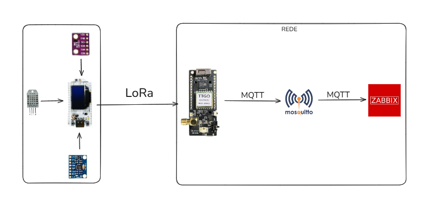

Projeto ESP32 LoRa com MQTT para Zabbix.

Este projeto tem como objetivo adquirir dados de sensores utilizando um módulo **ESP32 LoRa Heltec v3**, enviando essas informações via LoRa para um **ESP32 LoRa TTGO**, este segundo dispositivo envia, por sua vez, os dados através do protocolo **MQTT** para o **Zabbix** com o **Mosquitto** funcionando como broker MQTT. 

---

## 🧩 Tecnologias Utilizadas

- **ESP32 LoRa TTGO** – Microcontrolador com suporte LoRa (Long Range) para comunicação de longo alcance.  
- **ESP32 LoRa Heltec v3** – Microcontrolador com suporte LoRa (Long Range) para comunicação de longo alcance e display OLED.  
- **MQTT (Mosquitto)** – Protocolo leve de mensagens usado para envio dos dados.  
- **Zabbix** – Sistema de monitoramento de redes, utilizado para visualizar os dados.  
- **Arduino IDE 1.8.19** – Ambiente de desenvolvimento.  
- **Sensores** – DHT22, GY-BMP280, MPU6050.  

---

## Arquitetura

    

Os dados coletados (temperatura, umidade, pressão e movimento) são transmitidos sem fio para um gateway baseado em ESP32 LoRa, que publica as informações via MQTT para um broker Mosquitto. A partir daí, os dados são integrados ao Zabbix, permitindo monitoramento em tempo real. 

---

## Esquema de conexão

    

Este diagrama mostra a ligação dos três sensores à placa microcontroladora ESP32 LoRa Heltec V3, a alimentação de todos os componentes é feita com 3.3V. 

### 📦 Componentes Conectados:

#### 1. DHT22 (Sensor de Temperatura e Umidade)
- Alimentado com **3.3V**
- Pino de dados conectado ao **GPIO4**
- Resistor de **10kΩ pull-up** entre o pino de dados e 3.3V

#### 2. BMP280 (Sensor de Pressão e Temperatura - I2C)
- **SDA** → **GPIO41**
- **SCL** → **GPIO42**
- Alimentado com **3.3V**
- Outros pinos (CSB, SDO) não utilizados (I2C padrão)

#### 3. MPU6050 (Acelerômetro e Giroscópio - I2C)
- Compartilha o barramento I2C com o BMP280:
  - **SDA** → **GPIO41**
  - **SCL** → **GPIO42**
- Alimentado com **3.3V**
- Pinos **XDA/XCL** não utilizados (para comunicação auxiliar com outros sensores)

---

## Documentação

- 📘  [Configuração do Zabbix](ZABBIX.md)
- 📘  [Comunicação MQTT-Zabbix](MQTT.md)
- 📚  [Source-Sender](heltecSender/)
- 📚  [Source-Receiver](ttgoReceiver/)
- 📱  [TTGO LoRa](TTGO.md)
- 📱  [Heltec v3 LoRa](HELTECV3.md)
- 🔌  [DHT22](DHT22.md)
- 🔌  [GY-BMP280](BMP280.md)
- 🔌  [MPU6050](MPU6050.md)

## Protótipo 

    

