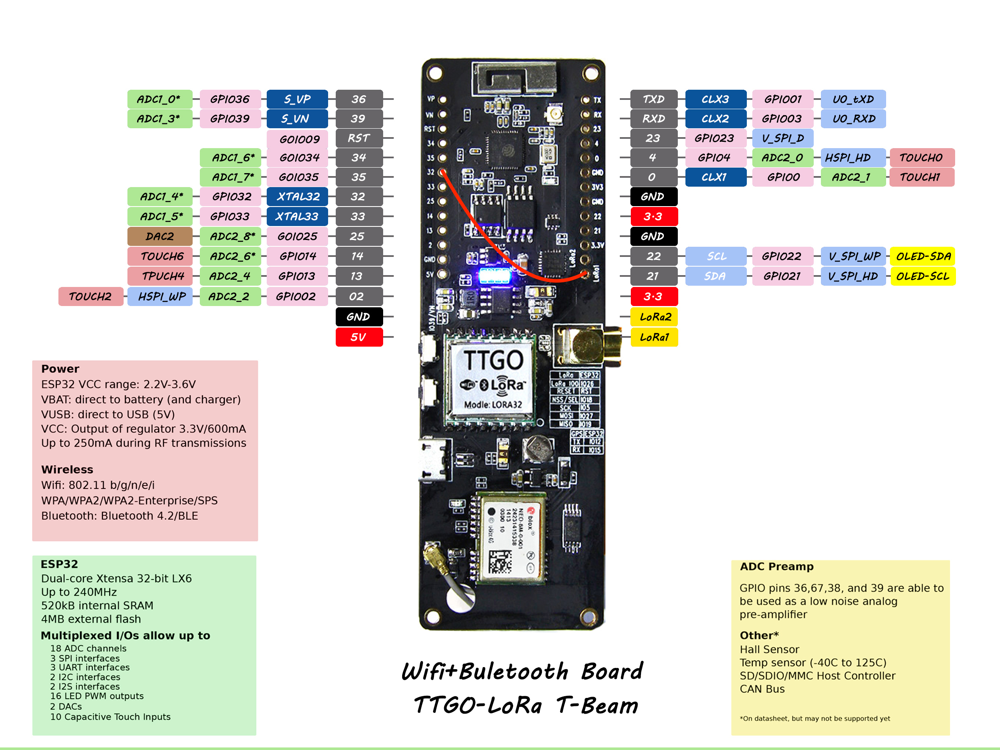

## 📱 ESP32 LoRa TTGO T-Beam

**Principais características:**
- Microcontrolador: ESP32 (dual-core, 240 MHz, Wi-Fi + Bluetooth)
- Módulo LoRa: Semtech SX1276
- Faixa de frequência: 915 MHz
- GPS Integrado: u-blox NEO-6M
- Conectores: micro USB, conector para antena LoRa, slot para bateria 18650
- Tensão de operação: 3.3 V
- [Referência](https://api.riot-os.org/group__boards__esp32__ttgo-t-beam.html?utm_source=chatgpt.com#esp32_ttgo_t_beam_mcu)

